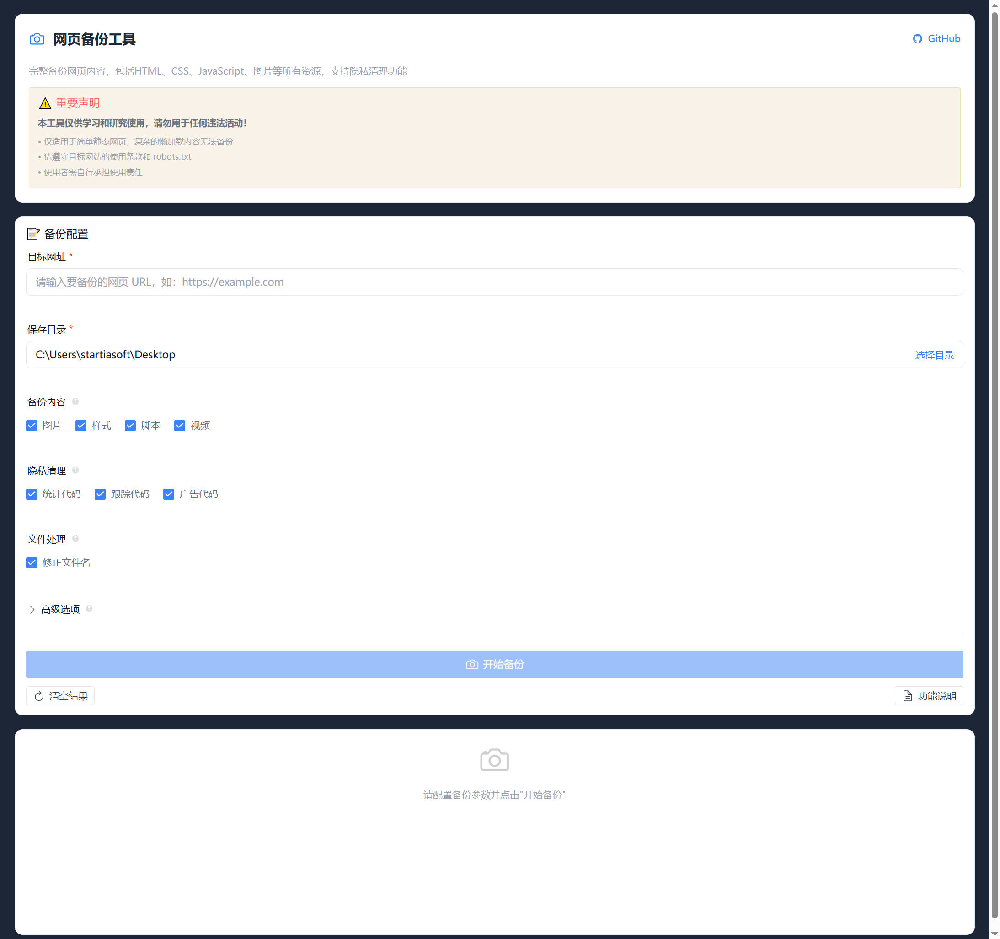
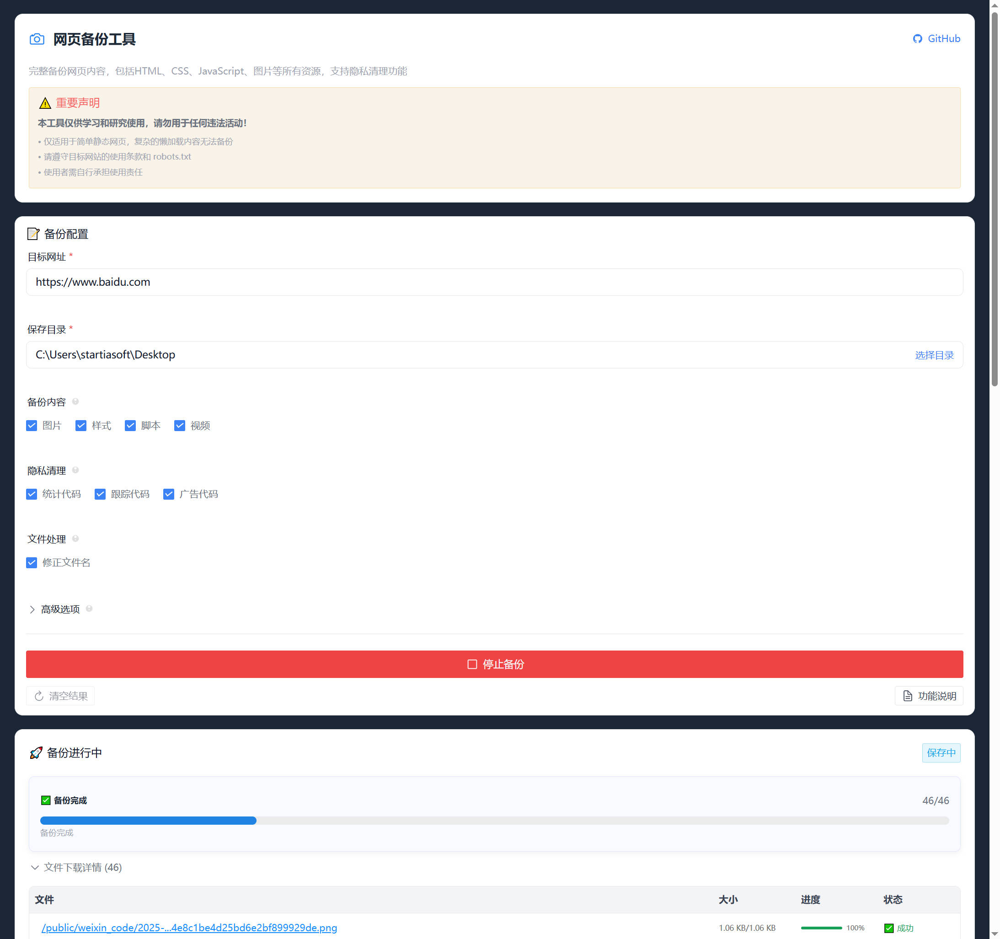
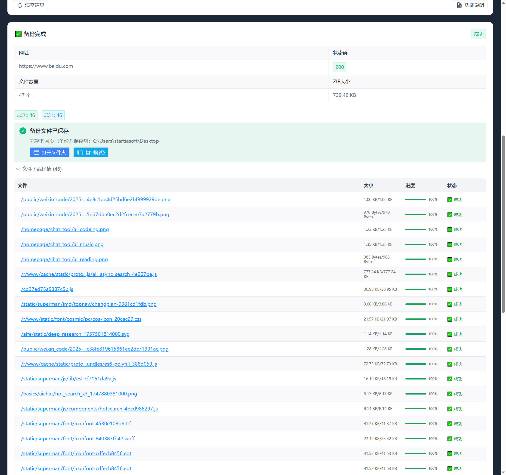

# SiteBackup - 网页备份工具

<div align="center">


一个基于 Wails 框架开发的网页备份工具，支持完整备份网页内容，包括 HTML、CSS、JavaScript、图片等所有资源，并提供隐私清理功能。

[](https://github.com/adiudiuu/site_backup)
[](LICENSE)
[](https://golang.org/)
[](https://vuejs.org/)
[](https://wails.io/)

[](https://github.com/adiudiuu/site_backup/stargazers)
[](https://github.com/adiudiuu/site_backup/network/members)
[](https://github.com/adiudiuu/site_backup/issues)
[](https://github.com/adiudiuu/site_backup/commits)

### ⭐ Star History

[](https://star-history.com/#adiudiuu/site_backup&Date)

</div>

## 📸 项目截图

<div align="center">

### 主界面


### 备份进行中


### 备份完成


</div>

## ⚠️ 重要声明

> **本工具仅供学习和研究使用，请勿用于任何违法活动！**

- 🎓 **学习目的**：仅用于学习网页技术和备份个人网站
- 📋 **遵守规则**：请遵守目标网站的 robots.txt 和使用条款
- 🚫 **禁止滥用**：不得用于恶意爬取、侵犯版权或其他违法行为
- ⚖️ **自负责任**：使用者需自行承担使用责任

## 🚀 功能特性

### 核心功能
- 📦 **完整备份**：备份网页的所有资源文件（HTML、CSS、JS、图片、视频等）
- 🛡️ **隐私清理**：自动移除第三方跟踪代码、统计代码、广告代码
- 📊 **实时进度**：显示备份进度和文件下载状态
- 🗜️ **ZIP 打包**：自动将备份文件打包为 ZIP 格式
- 📁 **目录选择**：支持选择自定义保存目录
- 📱 **响应式布局**：栅格布局，适应不同窗口大小
- 🌍 **跨平台**：支持 Windows、macOS、Linux

### 界面特性
- 🎨 **现代化 UI**：基于 Naive UI 的美观界面
- 📋 **详细配置**：丰富的备份选项配置
- 📈 **进度监控**：实时显示文件下载状态
- 🔍 **文件详情**：可查看每个文件的下载进度

## ⚠️ 功能限制

> **请注意：本工具主要适用于简单的静态网页备份**

### 技术限制
- ❌ **动态内容**：无法备份需要 JavaScript 动态加载的内容
- ❌ **懒加载**：不支持懒加载（lazy loading）内容
- ❌ **用户交互**：无法处理需要用户交互才显示的内容
- ❌ **SPA 路由**：不支持单页应用（SPA）的动态路由内容
- ❌ **登录内容**：无法备份需要登录才能访问的内容
- ❌ **复杂框架**：对于 React、Vue、Angular 等现代框架构建的复杂应用效果有限

### 适用场景
- ✅ **静态网站**：个人博客、企业官网等静态页面
- ✅ **简单页面**：新闻文章、产品介绍页面
- ✅ **文档网站**：技术文档、帮助页面
- ✅ **传统网站**：基于传统 HTML/CSS/JS 的网站

## 🛡️ 隐私清理功能

### 自动清理的内容
- 📊 **统计代码**：Google Analytics、百度统计、CNZZ、Mixpanel、Segment 等
- 👁️ **跟踪代码**：Facebook Pixel、TikTok Pixel、Snapchat Pixel、Hotjar、CrazyEgg、Clarity 等
- 📢 **广告代码**：Google Ads、DoubleClick、Taboola、Outbrain、PopAds、PropellerAds、AdCash 等
- 🏷️ **标签管理器**：Google Tag Manager (GTM) 等
- ⚠️ **恶意标签**：base 标签劫持、自动跳转、来源伪造、恶意重定向等

### 安全防护
- 🔒 **链接劫持防护**：自动删除所有 base 标签，防止恶意网站劫持页面中的所有相对链接
- 🚫 **自动跳转防护**：删除 meta refresh 标签，防止页面自动跳转到钓鱼网站或恶意网站
- 🎭 **来源伪造防护**：删除 meta referrer 标签，防止恶意网站伪造访问来源
- 🔄 **重定向防护**：检测并删除包含恶意重定向的 JavaScript 代码

## 🛠️ 技术栈

### 前端技术
- **框架**：Vue 3 + TypeScript
- **UI 库**：Naive UI
- **构建工具**：Vite
- **路由**：Vue Router 4
- **图标**：Ionicons 5

### 后端技术
- **语言**：Go 1.23+
- **框架**：Wails v2
- **网页解析**：goquery
- **文本编码**：golang.org/x/text
- **HTTP 客户端**：Go 标准库

### 开发工具
- **包管理**：Go Modules + npm
- **类型检查**：TypeScript + Vue TSC
- **代码格式化**：内置支持

## 📋 系统要求

### 开发环境
- **Go**：1.23 或更高版本
- **Node.js**：18 或更高版本
- **Wails CLI**：v2 最新版本

### 运行环境
- **Windows**：Windows 10/11 (x64)
- **macOS**：macOS 10.15+ (Intel/Apple Silicon)
- **Linux**：主流发行版 (x64)

## 🚀 快速开始

### 1. 克隆项目
```bash
git clone https://github.com/adiudiuu/site_backup.git
cd site_backup
```

### 2. 安装依赖
```bash
# 安装 Go 依赖
go mod tidy

# 安装前端依赖
cd frontend
npm install
cd ..
```

### 3. 开发运行
```bash
# 使用 Makefile（推荐）
make run

# 或直接使用 Wails CLI
wails dev
```

### 4. 构建发布
```bash
# 构建 Windows 版本
make build-win

# 构建 macOS 版本（需要在 macOS 上运行）
make build-mac

# 或使用 Wails CLI
wails build
```

## 🤖 MCP Server（AI 工具集成）

> **v1.1+ 新增**：SiteBackup 同时以 [MCP (Model Context Protocol)](https://modelcontextprotocol.io/) server 形式暴露能力，可被 Claude Desktop、Cursor、Continue 等 AI 客户端作为工具调用。

### 为什么做 MCP

- **反爬虫绕过**：当 SiteBackup 自身的 `http.Client` 抓不到目标（Cloudflare、JS 渲染、登录墙），可以让 MCP host 先用 `puppeteer-mcp` / `firecrawl-mcp` 拿 HTML，再传给 SiteBackup 做解析和打包
- **AI 工作流集成**：让 LLM Agent 能直接 "帮我把这个站打包" / "抓取并总结" / "对比两个版本"
- **能力组合**：SiteBackup 专注解析+清理+打包，反爬交给 host 已有的更强工具

### 构建 MCP Server

```bash
# 当前平台
make build-mcp

# 跨平台
make build-mcp-win
make build-mcp-linux
make build-mcp-mac

# 产物路径：bin/sitebackup-mcp[.exe]
```

### 注册到 Claude Desktop

编辑 Claude Desktop 配置文件：
- **Windows**：`%APPDATA%\Claude\claude_desktop_config.json`
- **macOS**：`~/Library/Application Support/Claude/claude_desktop_config.json`
- **Linux**：`~/.config/Claude/claude_desktop_config.json`

```json
{
  "mcpServers": {
    "sitebackup": {
      "command": "D:\AAAA\mdzz\site_backup\bin\sitebackup-mcp.exe"
    }
  }
}
```

重启 Claude Desktop 即可在工具列表看到 `capture_page`、`list_capabilities` 等工具。

### 暴露的工具

| 工具 | 说明 |
|---|---|
| `capture_page` | 抓取整页 HTML 及所有子资源，5 类隐私清理，ZIP 打包 |
| `get_capture_progress` | 进度查询（保留扩展点，MCP 同步模式下不常用） |
| `list_capabilities` | 列出能力清单与组合用法示例 |

### `capture_page` 参数

| 参数 | 类型 | 必填 | 默认 | 说明 |
|---|---|---|---|---|
| `url` | string | ✅ | — | 目标 URL |
| `html` | string | ❌ | — | 预取 HTML（来自 puppeteer-mcp 等），非空时跳过内部 fetch |
| `options.includeImages` | bool | ❌ | `true` | 备份图片 |
| `options.includeStyles` | bool | ❌ | `true` | 备份 CSS |
| `options.includeScripts` | bool | ❌ | `true` | 备份 JS |
| `options.includeFonts` | bool | ❌ | `true` | 备份字体 |
| `options.includeVideos` | bool | ❌ | `true` | 备份视频 |
| `options.removeAnalytics` | bool | ❌ | `true` | 剥离 Google Analytics / 百度统计 / CNZZ 等 |
| `options.removeTracking` | bool | ❌ | `true` | 剥离 Facebook Pixel / TikTok Pixel 等 |
| `options.removeAds` | bool | ❌ | `true` | 剥离 Google Ads / DoubleClick 等 |
| `options.removeTagManager` | bool | ❌ | `true` | 剥离 Google Tag Manager |
| `options.removeMaliciousTags` | bool | ❌ | `true` | 剥离恶意跳转/劫持标签 |
| `options.timeout` | int | ❌ | `120` | 超时（秒），60-300 |
| `options.maxFiles` | int | ❌ | `200` | 最大文件数，10-1000 |
| `options.maxConcurrency` | int | ❌ | `10` | 并发下载数，1-50 |
| `options.forceEncoding` | string | ❌ | 自动 | 强制编码 (UTF-8/GBK/GB18030/Big5/...) |

### 与 puppeteer-mcp 组合（推荐）

先用 puppeteer-mcp 抓 HTML（带 JS 渲染+反爬绕过），再传给 sitebackup 做解析打包：

```
用户：帮我抓 https://example.com，整站打包，剔除所有跟踪代码

Agent:
  1. puppeteer_mcp.browse({url: "https://example.com"})
     → html
  2. sitebackup.capture_page({
       url: "https://example.com",
       html: html,
       options: {removeAnalytics: true, removeTracking: true}
     })
     → {zipPath: "/tmp/webpage_xxx.zip", filesCount: 47, ...}
  3. host 自动 Read ZIP 内容
  4. LLM 总结/分析
```

### 在 Claude Desktop 中实际效果

启动 Claude Desktop 后，对话框里输入：

> 用 sitebackup 工具抓取 https://example.com，关闭 GA 和 Facebook Pixel，保存到桌面

Claude 会自动调用 `capture_page` 并返回 ZIP 路径，然后调用系统的打开文件管理器（如果启用了 host 端的 OpenDirectory 工具）。

### 架构示意

```
┌─────────────────────────────────────────────────────────────┐
│  MCP Host (Claude Desktop / Cursor / 自研 Agent)            │
│  ┌─────────────────────┐  ┌─────────────────────┐           │
│  │  puppeteer-mcp      │  │  sitebackup-mcp     │           │
│  │  (反爬/JS渲染)      │→→│  (解析/清理/打包)    │           │
│  └─────────────────────┘  └──────────┬──────────┘           │
└──────────────────────────────────────┼──────────────────────┘
                                       │ stdio JSON-RPC
                              ┌────────▼─────────┐
                              │ bin/sitebackup-  │
                              │     mcp.exe      │
                              │ (12.9MB 静态二进制)│
                              └────────┬─────────┘
                                       │
                          ┌────────────▼────────────┐
                          │ services.PageCaptureService │
                          │  (与 Wails 桌面端共用)        │
                          └─────────────────────────┘
```

### 开发者：手动测试

```bash
# 终端 A：启动 MCP server
make build-mcp && ./bin/sitebackup-mcp.exe

# 终端 B：用 jq/curl 模拟 MCP 客户端（需要 stdio 桥接工具，如 mcp-cli）
# 或直接在 Claude Desktop 里使用
```

## 📖 使用指南

### 基本使用步骤
1. **输入网址**：在目标网址框中输入要备份的网页 URL
2. **选择目录**：点击"选择目录"按钮，选择备份文件的保存位置
3. **配置选项**：
   - 选择要备份的内容类型（图片、样式、脚本、视频）
   - 选择要清理的隐私内容（统计代码、跟踪代码、广告代码）
   - 调整高级选项（超时时间、最大文件数、并发数）
4. **开始备份**：点击"开始备份"按钮
5. **监控进度**：实时查看备份进度和文件下载状态
6. **完成备份**：备份完成后，ZIP 文件将保存到指定目录

### 使用建议
- 🎯 **优先选择**：静态网站或博客进行备份
- ⚠️ **避免备份**：复杂的动态网站或 SPA 应用
- 🧪 **先测试**：测试小页面后再备份大型网站
- ⏱️ **注意频率**：注意网站的访问频率限制，避免过于频繁的请求
- 📏 **合理配置**：根据网络情况调整超时时间和并发数

### 故障排除
- **网络错误**：检查网络连接和 URL 是否正确
- **访问被拒**：可能遇到反爬虫机制，建议稍后重试
- **文件过大**：调整最大文件数限制或增加超时时间
- **权限问题**：确保对保存目录有写入权限

## 🤝 贡献指南

欢迎提交 Issue 和 Pull Request！

### 开发流程
1. Fork 本仓库
2. 创建特性分支 (`git checkout -b feature/AmazingFeature`)
3. 提交更改 (`git commit -m 'Add some AmazingFeature'`)
4. 推送到分支 (`git push origin feature/AmazingFeature`)
5. 开启 Pull Request

### 代码规范
- Go 代码遵循 `gofmt` 格式
- TypeScript 代码使用 ESLint 规范
- 提交信息使用英文，格式清晰

## 📄 许可证

本项目采用 **GNU General Public License v3.0** 许可证。

这意味着：
- ✅ 可以自由使用、修改和分发
- ✅ 可以用于商业目的
- ⚠️ 修改后的代码必须开源
- ⚠️ 必须保留原始许可证和版权声明
- ⚠️ 不提供任何担保

详细信息请查看 [LICENSE](LICENSE) 文件。

## ⚖️ 免责声明

- 本工具仅供学习和研究使用
- 使用本工具产生的任何法律后果由使用者自行承担
- 开发者不承担任何责任
- 请确保您的使用行为符合当地法律法规和目标网站的使用条款
- 请尊重网站的 robots.txt 文件和访问限制

## 📞 联系方式

- **GitHub Issues**：[提交问题](https://github.com/adiudiuu/site_backup/issues)
- **项目主页**：https://github.com/adiudiuu/site_backup

---

<div align="center">

**⭐ 如果这个项目对你有帮助，请给它一个 Star！**

Made with ❤️ by [adiudiuu](https://github.com/adiudiuu)

</div>